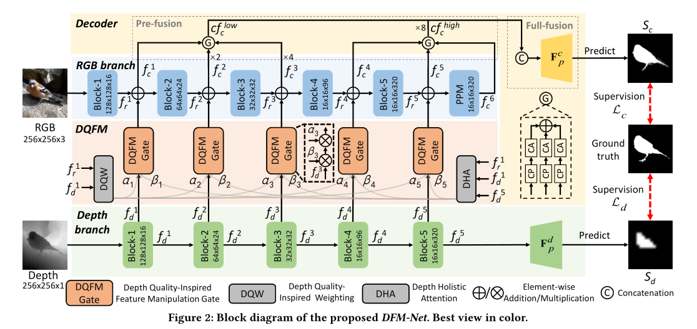

## 
摘要  
基于RGBD显著目标检测模型在减少模型参数时，模型精度通常会下降，且受到深度质量的影响。本文设计了一种基于深度质量的特征操作(DQFM)：利用低级RGB和深度特征的对齐，以及深度流的整体关注来明确控制和增强跨模态融合。这是一个轻量化模型。  

高质量的深度图通常具有一些与相应RGB图像对齐的边界

### Efficient RGBD SOD Method

将知识蒸馏就是用于深度蒸馏器，将从深度流获取到的深度知识转移到RGB流，从而实现无深度推理框架，后Chen设计了一个定制的深度主干，以提取互补特征

### 
网络结构图

由编码器和解码器构成，其中RGB分支同时负责RGB特征提取和RGB与深度特征之间的交叉模式融合，另一方面解码器部分负责进行简单的两阶段融合以生成最终的显著性图，具体的说就是：编码器包括一个基于MobileNet-v2的RGB相关分支，一个深度相关分支，以及DQFM。在某个层次提取的深度特征通过DQFM后，再经过简单的元素加法融合到RGB分支中，然后发送到下一个层次。为了捕获多尺度语义信息，在RGB分支的末尾添加了PPM(金字塔池模块),在实际操作中，DQFM包含两个连续操作，深度质量启发加权和深度整体注意。  

### 
DQW结构

首先将低层特征$ f_{r}^{1}$ 和 $ f_{d}^{1}$ 转化为特征$ f_{rt^{'}}$和$ f_{dt^{'}}$,
$$ \large f_{rt^{'}}=BConv_{1\times1}(f_{r}^{1}),f_{dt^{'}}=BConv_{1\times1}(f_{d}^{1})$$

其中$BConv$表示$1\times1$卷积和$ReLU$激活函数，为了评估低级特征对齐，对这两个特征进行对齐编码
$$ \large V_{BA}=\dfrac{GAP(f_{rt^{'}}\otimes f_{dt^{'}})}{GAP(f_{rt^{'}} + f_{dt^{'}})}$$

其中$GAP(\cdot)$表示全局平均池化操作，$\otimes$表示按元素乘法。增强向量的计算方式：
$$ \large V_{BA}^{ms}=[V_{BA},V_{BA}^{1},V_{BA}^{2}]$$ 
其中[$\cdot$]表示通道串联。然后使用两个完全连接的层使得$\alpha\in\mathbb{R}^{5}$转化到$V_{BA}^{ms}$计算方式为：
$$\large\alpha=MLP(V_{BA}^{ms})$$
$MLP(\cdot)$表示末端为$Sigmoid$函数的感知器。

### 
DHA结构

首先利用最高级特征$f_{d}^{5}$从深度流定位粗糙的突出区域，使用压缩和上采样方式使得$f_{d}^{5}$转化为$f_{dht}$计算方式为
$$\large f_{dht}=F_{UP}^{8}(BConv_{1\times1}(F_{DN}^2(f_{d}^5))$$

其中$F_{UP}^{8}$表示8层双线性上采样，然后结合低层RGB和深度特征进行重新校准。为了更好地模拟低水平和高水平特征之间的长期依赖性，同时保持DHA的效率，我们采用最大池运算和扩大卷积来快速增加感受野。重新校准过程定义为：
$$ \large F_{rec}(f_{dht})=F_{UP}^{2}(DConv_{3\times3}(F_{DN}^{2}(f_{dht}+f_{ec})))$$

$F_{rec}(\cdot)$表示重新校准过程。$DConv_{3\times3}(\cdot)$表示$3\times3$扩张卷积，步长为1，扩张率为2.然后是$BatchNorm$和$ReLU$激活函数，$F_{UP}^{2}(\cdot)/F_{DN}^{2}(\cdot)$表示双线性上采样\下采样操作。为提高性能，再进行两次重新校准。
$$\large f_{dht}^{'}=F_{rec}(f_{dht}),f^{''}_{dht}=F_{rec}(f^{'}_{dht})$$

最终实现整体注意力地图：
$$\large \beta=BConv_{3 \times 3}(f_{ec}+f_{dht}^{''})$$

最后获得五张深度整体注意图$\large\{{\beta_{1},\beta_{2},\beta_{3},\beta_{4},\beta_{5}}\}$如下图所示：  

通常情况下，深度学习不如RGB图像，为实现效率和准确性的平衡，本文选择定制深度主干(TDB)，具体来说就是基于$MobliceNetV2$中的反向剩余瓶颈块(IRB)并构建一个新的更小的主干，减少信道数量和堆叠块。结构如下：

## 解码器

简化版的两级解码器，包括预融合和完全融合，预融合是通过信道压缩和层次分组来减少特征信道和层次，完全融合则是进一步聚合低层和高层特征，生成最终的显著图。

### 预融合阶段

首先使用具有$BatchNorm$和$ReLU$激活的$3\times3$深度可分离卷积，表示为$DSConv_{3\times3}$,将压缩编码器特征$f_{c}^{i},(i=1,2,...6)$到统一信道16，然后使用通道注意算子$F_{CA}$通过加权不同信道来增强特征。这个过程可以表示为：
$$\large cf_{c}^{i}=F_{CA}(DSConv_{3\times3}(f_{c}^{i}))$$
其中$cf_{c}^{i}$表示压缩和增强功能。为了减少特征层次，作者将6个层次分为两个层次(低级层次和高级层次)
$$ \large cf_{c}^{low}=\sum_{i=0}^{3}F_{UP}^{2^{i-1}}(cf_{c}^{i}),cf_{c}^{high}=\sum_{i=4}^{6}cf_{c}^{i}$$

### 聚合模块

由于在预融合阶段，信道数量和层次已经减少，在全融合阶段，我们直接将高层和低层层次串联起来，然后将串联馈送到预测头，以获得最终的全分辨率预测图，表示为：$$ \large S_c=F_{p}^{c}([cf_{e}^{low},F_{UP}^{8}(cf_{c}^{high})])$$其中$S_c$表示最终的显著性图，$F_{p}^{c}(\cdot)$表示一个预测头，由两个$3\times3$深度方向可分离卷积（然后是$BatchNorm$层和$ReLU$激活）、一个$3\times3Sigmoid$激活卷积以及一个$2\times$双线性上采样组成，以恢复原始输入大小。

## 损失函数
总损失$\pounds$最终由深度分支损失$\pounds_{c}$和深度监管损失$\pounds_{d}$构成，
$$\large \pounds = \pounds_{c}(S_{c},G)+ \pounds_{d}(S_{d},G)$$
我们使用的是标准的交叉熵损失